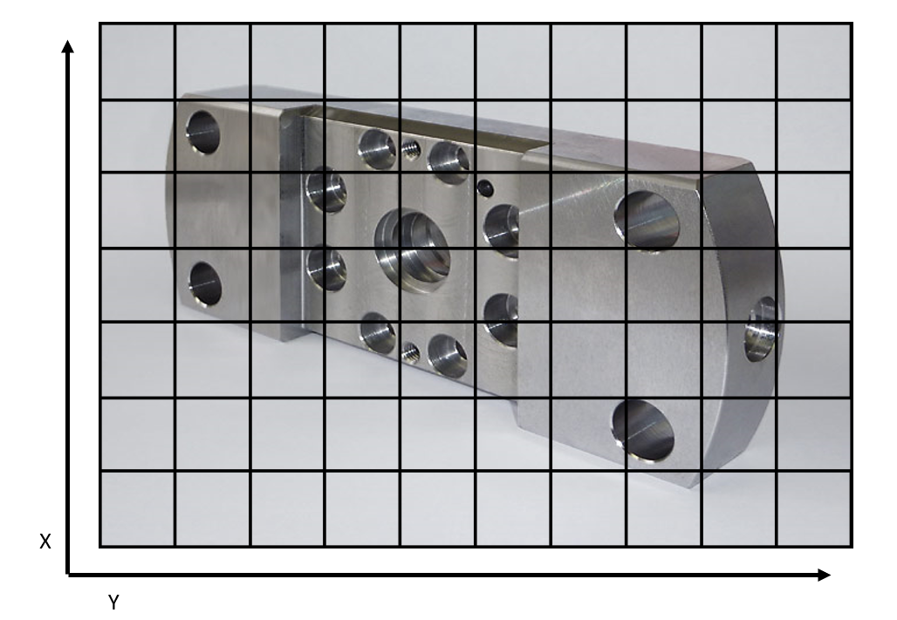

# USE CASE: Maschinenfehler-Erkennung

> ## Aufgabenstellung und Bewertungskriterien Doku

> - Dokumentation der Anwendung ist vorhanden
> - Dokumentation enthält:
> - Idee der Anwendung
> - Architektur
> - Entwurf
> - Screencast der Demo
> - etc.

## Inhaltsverzeichnis

1. [Idee der Anwendung](#idee)
2. [Anwendungsszenarien](#anwendung)
3. [Architektur](#architektur)
4. [Starten der Anwendung](#start)
5. [Screencast](#screencast)
6. [Sonstiges](#sonstiges)

## Idee der Anwendung <a name="idee"></a>

- Ein Industrieunternehmen produziert in der Massenfertigung auf vielen Maschinen das selbe Teil
- Nach der Produktion wertet ein Arbeiter/eine Maschine die Teile aus
- Mitarbeiter hat einen Bildschirm mit einem Bild des Teiles, über welches ein Raster (x/y-Koordinaten) gelegt ist
- Mitarbeiter klickt defekte Stelle an
  - optional: Fehlergrund wird mitangegeben

### Skizze



_hier ggf. image der Weboberfläche einfügen_

## Anwendungsszenarien <a name="anwendung"></a>

- Häufige Fehler erkennen
- Zusammenhänge von Fehler erkennen
  - Fehler immer zu bestimmter Uhrzeit / bestimmter Tag
  - Fehler geht von bestimmter Maschine aus
  - Fehler tritt in bestimmtem Werk auf

## Architektur <a name="architektur"></a>

> einzelne Elemente noch genauer beschreiben


#### Load Balancer (Ingress)

-
-

#### Web Server (Node.js)
Der Web Server ist mit Node.js in JavaScript entwickelt. Er verarbeitet alle Anfragen der Clients und beantwortet diese. Beispielsweise wird entsprechender HTML Code an den Cient übermittelt, um die Website darzustellen.

#### Cache Server (Memcached)

-
-

#### Database Server (MySQL-Datenbank)
Die Datenbank besteht insgesamt aus vier Tabellen. Die einzelnen Felder der Tabllen können der nachfolgenden Abbildung entnommen werden.


- Maschines
  - Enthält die Daten aller Maschinen des Herstellers für die Fehler erhoben werden können, wie zum Beispiel den Namen der Maschine 
- Failures
  - Enthält die Daten aller Fehler, die potentiell auftreten können
- Fault_Parts
  - Enthält die Daten aller festgestellten Fehler, wie zum Beispiel das Erfassungsdatum oder die Id der Maschine, an welcher der Fehler festgestellt wurde
- Shift_Statistics
  - Enthält aufbereitete Daten, die darstellen, welche Fehler wie oft in welcher Schicht aufgetreten sind

#### Big Data&Science Processing (Spark)

-
-

#### Big Data Messaging (Kafka)

-
-

#### Data Lake (HHDFS)

-
-

## Starten der Anwendung <a name="start"></a>

Minikube start

```
minikube start --driver=docker
```

Enable Load Balancer (Ingress)

```
minikube addobs enable ingress
```

A running Strimzi.io Kafka operator

```bash
helm repo add strimzi http://strimzi.io/charts/
helm install my-kafka-operator strimzi/strimzi-kafka-operator
```

A running Hadoop cluster with YARN (for checkpointing)

```bash
helm repo add stable https://charts.helm.sh/stable
helm install --namespace=default --set hdfs.dataNode.replicas=2 --set yarn.nodeManager.replicas=2 --set hdfs.webhdfs.enabled=true my-hadoop-cluster stable/hadoop
```

To develop using [Skaffold](https://skaffold.dev/), use `skaffold dev`.

Webanwendung aufrufen

```
kubectl get ingress
```

liefert die IP-Adresse

## Screencast <a name="screencast"></a>

> Video oder Link zum Video einfügen

## Sonstiges <a name="sonstiges"></a>

> text...
