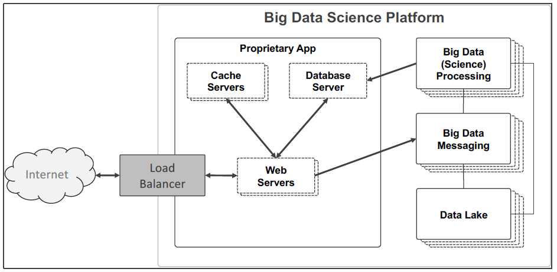
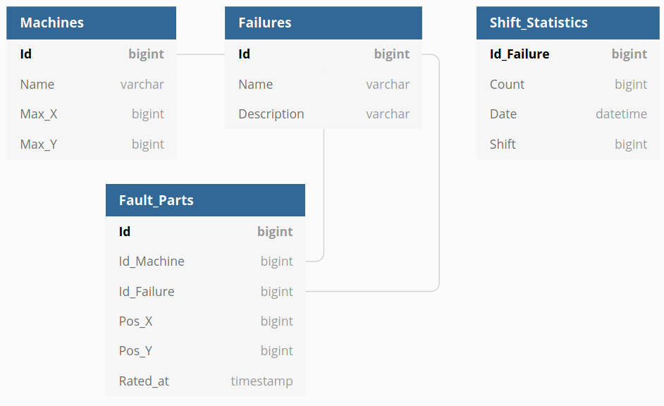
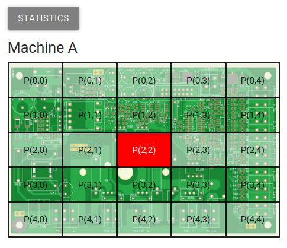
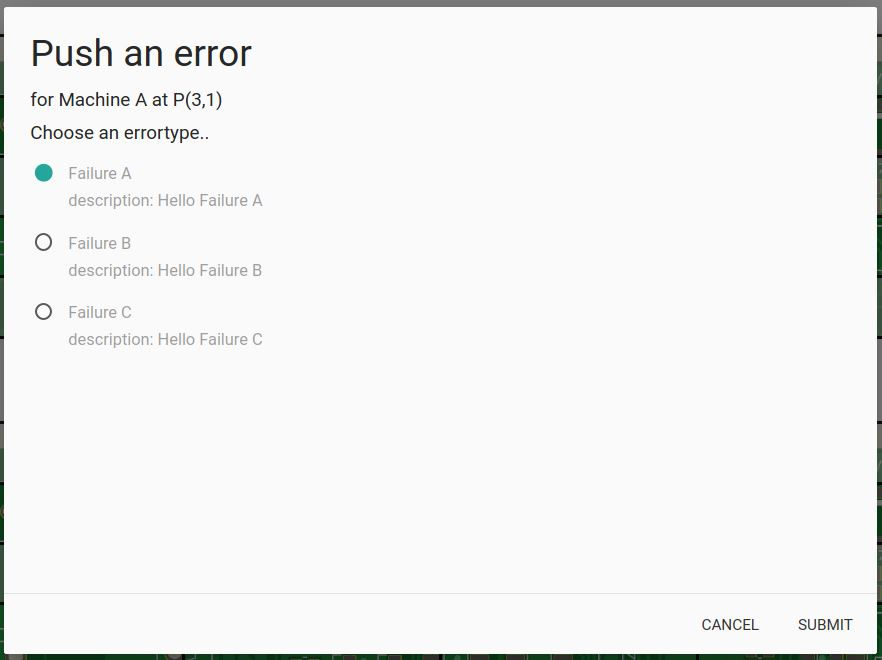
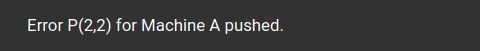
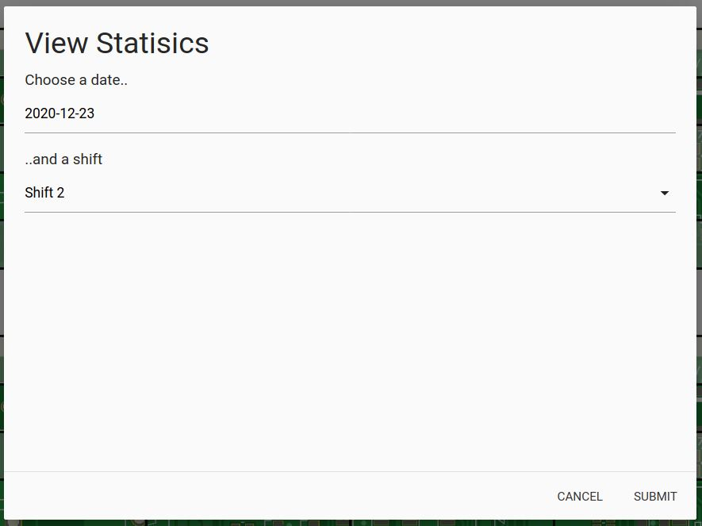
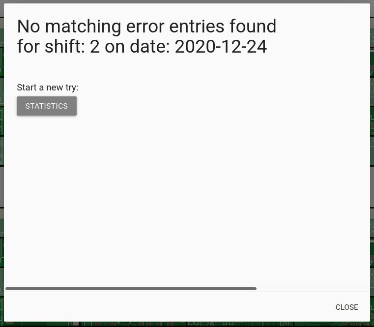
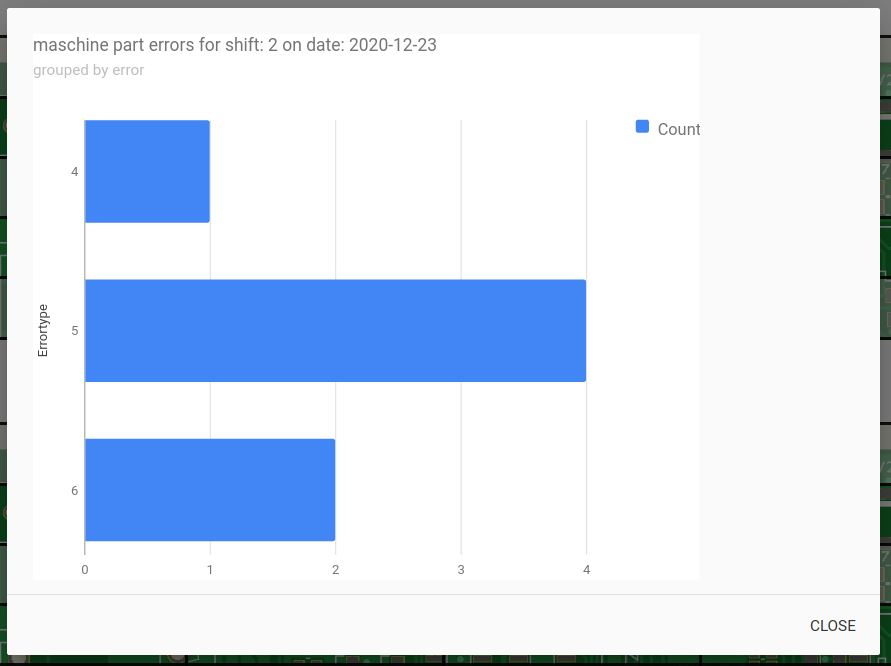

# Produktionsfehler Erkennung

## Inhaltsverzeichnis

1. [Einführung](#intro)
2. [Architektur](#architektur)
3. [Frontend](#frontend)
5. [Starten der Anwendung](#start)
6. [Screencast](#screencast)
7. [Ausblick](#ausblick)

## Einführung <a name="intro"></a>
In diesem Kapitel wird die Idee der Anwendung zur Erkennung von Produktionsfehlern erläutert.

### Anwendungsfall
Ein Unternehmen hat sich auf die Herstellung von Leiterplatten in Großserie spezialisiert. Die Leiterplatten werden nach Kundenanforderungen entworfen, mit Prototypen getestet und danach automatisiert in Serie gefertigt. Um den hohen Stückzahlen gerecht zu werden, werden die Leiterplatten parallel auf mehreren Maschinen produziert.

Der Qualitätsanspruch ist sehr hoch, da beschädigte oder fehlerhafte Leiterplatten zu Problemen im Endprodukt des Kunden führen. Vermehrt ist festzustellen, dass zum Beispiel bei Verunreinigungen an der Maschine, mehrere Leiterplatten die selben Fehler aufweisen. Um die Qualität zu Überprüfen werden daher automatisierte Tests ausgeführt. Dennoch sind manuelle Überprüfungen durch einen Mitarbeiter notwendig.

Über die Anwendung zur Erkennung von Produktionsfehlern kann der Mitarbeiter Fehler an einer Leiterplatte dokumentieren. In der Anwendung ist für jede Maschine die produzierte Leiterplatte dargestellt und über diese ist ein Raster gelegt. Per X/Y Koordinaten werden verschiedene Bereiche im Raster adressiert. Der Mitarbeiter kann mittels der Anwendung angeben, an welcher Stelle auf der Leiterplatte er einen Fehler identifiziert hat. Hierfür klickt er auf einen Bereich des Rasters einer Leiterplatte an der entsprechenden Maschine. Danach kann über eine Maske der festgestellte Fehler dokumentiert werden.

### Ziele
Die Produktion erfolgt über mehrere Wochen/Monate hinweg im Schichtbetrieb (Früh-, Spät- und Nachtschicht). Die Fehlerdokumentation soll nun eine zeitbezogene statistische Auswertung ermöglichen, um festzustellen wie viele und welche Fehler in einer Schicht aufgetreten sind. Basierend darauf werden dann Qualitätsurteile getroffen und bestimmt wie erfolgreich eine Schicht war (bzw. wie viel Ausschuss produziert wurde).

Die Anwendung verfügt hierfür über eine Maske in der angegeben werden kann, für welches Datum und welche Schicht die Fehlerstatistik angezeigt werden soll. Basierend auf diesen Daten wird dann in einem Balkendiagramm anzeigt, wie oft welcher Fehler in dieser Schicht aufgetreten ist.

## Architektur <a name="architektur"></a>
In diesem Kapitel wird die Architektur der Anwendung im Detail beschrieben.



### Verzeichnisstruktur
Alle Quelltextdateien der Anwendung sind im src Verzeichnisse enthalten. Dieses enthält die folgenden Verzeichnisse und Dateien. Nachfolgend werden nur zwei Unterebenen dargestellt. Verzeichnise auf zweiter Unterebene können weitere Dateien enthalten.

- k8s -> enthält alle Dateien ...
  - kafka-cluster.yaml
  - memcached.yaml
  - mysql.yaml
  - popular-slides-app.yaml
- spark-app -> enthält alle Dateien ...
  - Dockerfile 
  - requirements.txt
  - spark-app.py
- web-app -> enthält alle Dateien des Webservers und des Frontends
  - materialize
  - node_modules
  - views
  - Dockerfile
  - index.js
  - package-lock.json
  - package.json
- README.md
- skaffold.yaml

### Komponenten
In diesem Kapitel werden die einzelnen Komponenten der Anwendung im Detail beschrieben.

#### Load Balancer (Ingress)
Ingress stellt den Teil der Webanwendung nach außen über eine IP-Adresse zur Verfügung. Davor muss Ingress als Addon in Minikube aktiviert werden. 

#### Web Server (Node.js)
Der Webserver wurde in JavaScript mit Node.js und Express entwickelt. Er verarbeitet und beantwortet alle HTTP Anfragen der Clients an den Server. Beispielsweise wird dabei HTML Markup zur Darstellung des Frontends an den Client übermittelt.
Die HTTP Anfragen werden mittels Requesthandler, die von Express bereitgestellt werden entgegen genommen.
Darüber hinaus werden mittels Express statisches Ressourcen, wie Stylesheets für die Clients öffentlich gemacht. Diese Ressourcen sind im Verzeichnis materialize abgelegt.
Für die Entwicklung des Frontends wurde EJS verwendet. Mit dieser Templatesprache kann HTML Markup mittels Javascript erzeugt werden. Die verwendeten Templates (z.B. für die index.html) sind im Verzeichnis views abgelegt.

Folgende HTTP Requests werden vom Webserver verarbeitet.
- GET / -> liest alle Maschinen- und Fehlerinformationen aus der Datenbank aus, erzeugt mit diesen Daten und einem EJS Template das HTML Markup für die Startseite
- POST / -> entnimmt dem HTTP Request ein JSON Objekt, dass einen aufgetretenen Fehler beschreibt, fügt diesem einen Zeitstempel vom Server hinzu und versendet eine Tracking Botschaft an Kafka
- POST /Statistic -> entnimmt dem HTTP Request ein JSON Objekt, dass das Datum und die Schicht zum Anzeigen der Statistk enthält, ermittelt die entsprechenden Statistikwerte aus der Datenbank und sendet diese als JSON Array im HTTP Response an den Client
- POST /Random -> entnimmt dem HTTP Request ein JSON Objekt, dass angibt, für wie viele Tage in der Vergangenheit zufällige Daten erzeugt werden sollen und erzeugt dann beliebige Daten

Folgende Funktionen werden vom Webserver genutzt.
- getMachinesFromDatabaseOrCache
  - Liest die Daten aller Maschinen aus der Datenbank aus und speichert diese im Cache. Bei erneuter Verwendung werden die Daten aus dem Cache bezogen.
  - Parameter: -
  - Return Value: Array mit Maschinen Objekten im JSON Format
- getFailuresFromDatabaseOrCache
  - Liest die Daten aller Fehler aus der Datenbank aus und speichert diese im Cache. Bei erneuter Verwendung werden die Daten aus dem Cache bezogen.
  - Parameter: -
  - Return Value: Array mit Fehler Objekten im JSON Format
- reportFailurePart
  - Sendet eine Tracking Botschaft für einen festgestellten Fehler an Kafka. Dabei wird dem Fehler ein Zeitstempel vom Server mitgegeben.
  - Parameter: failurePart[JSON] -> Festgestellter Fehler im JSON Format, ratedAt[int] -> Zeitstempel vom Server als Integer
  - Return Value: -
- getFailurePartStatistic
  - Liest die erfassten Fehler-Statistiken für eine Schicht an einem bestimmten Datum aus.
  - Parameter: shift[int] -> Schicht, date[Date] -> Datum der Fehlererfassung
  - Return Value: Statistik Objekt im JSON Format
- createRandomData
  - Erzeugt zufällige Fehlerdaten und sendet diese an Kafka
  - Parameter: days[int] -> Anzahl der vergangenen Tage für welche Fehlerdaten erzeugt werden, data[JSON] -> Maschinen und Fehler die in der Datenbank gespeichert sind
  - Return Value: -

#### Cache Server (Memcached)
Hier werden statische Daten aus der Datenbank vom Web Server zwischengepeichert. Dies sind Daten zu den verfügbaren Maschinen und Fehlern. Für die Maschinen und Fehler werden eigene Keys erstellt und im Cache abgelegt. Neben dem Key werden dann die, aus der Datenbank ausgelesenen, Daten abgelegt. Im Memecached werden die Daten maximal X Sekunden zwischengespeichert. Erfolgt in dieser Zeit eine erneute Abfrage der Daten, werden diese über den Cache geladen anstatt über die Datenbank.

#### Database Server (MySQL-Datenbank)
Die Datenbank besteht insgesamt aus vier Tabellen. Die einzelnen Felder der Tabllen können der nachfolgenden Abbildung entnommen werden.



- Maschines
  - Enthält die Daten aller Maschinen des Herstellers für die Fehler erhoben werden können, wie zum Beispiel den Namen der Maschine 
- Failures
  - Enthält die Daten aller Fehler, die potentiell auftreten können
- Fault_Parts
  - Enthält die Daten aller festgestellten Fehler, wie zum Beispiel das Erfassungsdatum oder die Id der Maschine, an welcher der Fehler festgestellt wurde
- Shift_Statistics
  - Enthält aufbereitete Daten, die darstellen, welche Fehler wie oft in welcher Schicht aufgetreten sind

#### Data Lake (HHDFS)
- Im HDFS werden einzelne temporäre Checkpoints gespeichert, die Spark während der Ausführung erzeugt. Diese ermöglichen bei Fehlern ein Wiederaufsetzen an den einzelnen Punkten
- Ebenfalls werden die Empfangenen Rohdaten in einer CSV-Datei auf dem HDFS direkt gespeichert. Dies ermöglicht den späteren Zugriff auf die Originaldaten und entspricht auch dem Gedanke des Data Lakes. Dadurch können in Zukunft weitere und auch komplexere Analysen und Verarbeitungen auf den Daten durchgeführt werden. In unserem Use Case könnte man beispielsweise zukünftig auch Auswertungen über die konkreten Fehlerstellen und Maschinen führen, um Zusammenhänge zu erkennen. 


#### Big Data&Science Processing (Spark)
- An dieser Stelle werden die gesendeten Nachrichten von Kafka gelesen.
- Diese werden anschließend in mehreren Schritten verarbeitet.
  - Die Daten werden im ersten Schritt von einem JSON in ein vordefiniertes Schema geparsed
  - Diese Empfangen Rohdaten werden im HDFS abgelegt.
  - Für eine weitere Verarbeitung werden an den Data-Frame weitere Spalten hinzugefügt. Mit Hilfe einer UDF wird jeder Datensatz einer Schicht zugeordnet und es wird zusätzlich jedem Datensatz ein Datum (ohne Uhrzeit) anhand des empfangenen Timestamp zugewiesen.  
  - Anhand der nun vorhandenen Werte wird nun eine Gruppierung durchgeführt. Es wird nach Datum, Schicht und Fehler Id gruppiert, wobei die Fehler aufaddiert werden (cnt). Durch die Reduzierung der Daten gehen einige daten 'verloren'. Diese dienen jedoch nicht dem Auswertungsziel und sind zudem auch im HDFS gespeichert.
  - Hierbei wird Sparkstreaming window computation mit einem Zeitfenster von 5 Minuten verwendet.
  - Die gruppierten Werte werden anschließend in einer Tabelle 'Shift_Statistics' gespeichert und so für Auswertungen bereitgestellt.
 
 - Die Zuweisung einer Schicht geschieht nach folgendem Schema:
   - Shift 1:  0:00 - 07:59 Uhr
   - Shift 2:  8:00 - 15:59 Uhr
   - Shift 3: 16:00 - 23:59 Uhr
   
  Es werden mit der aktuellen Version von Kafka beim verarbeiten der Frame Warnungen geworfen im Zusammenhang von UDF. Diese können vernachlässigt werden siehe [Kafka Issue](https://issues.apache.org/jira/browse/KAFKA-1894).

#### Big Data Messaging (Kafka)
 - Messaging System zwischen Apache Spark und HDFS
- Das Kafka Cluster wird über helm gestartet
- Es besteht eine Replikation
- Die Daten werden von dem Server mit Hilfe von Kafka an den Spark-Pod gestreamt.
- Dies ermöglicht das senden zahlreicher und paralleler Nachrichten.


## Frontend <a name="frontend"></a>
Die Benutzeroberfläche der Anwendung wird im Webbrowser dargestellt. Dabei werden grundlegend zwei Funktionalitäten angeboten. Zum einen kann der Nutzer einen spezifischen Fehler dokumentieren, den er an einem von einer bestimmten Maschine erzeugtem Teil festgestellt hat. Des Weiteren kann der Nutzer Statistiken zu bestimmten Fehlern aufrufen.

Der notwendige Programmcode für die Darstellung der Oberfläche ist im Template index.ejs gebündelt. Das Template beinhaltet neben dem HTML Code auch den für CSS und JavaScript.

Die Datenarrays für die aktuellen Maschinen und Fehlercodes werden direkt über die index.js (node.js) befüllt. Dafür werden die bereits angesprochenen getMaschinesFromDatabaseOrCache und getFailuresFromDatabaseOrCache für die Ermittlung der Daten verwendet.

### Funktionen

 - loopMaschineArray
   - Diese Funktion spiegelt den Einstiegspunkt wider. Sie wird beim Seitenaufbau aufgerufen und loopt über die Variable maschineArray. Dieser Array über node.js direkt befüllt ausgeliefert. Pro Schleifendurchlauf (= Maschine) wird die Funktion addMaschineTable aufgerufen.

- addMaschineTable
  - In dieser Funktion wird der HTML DOM für die Anzeige der Maschinentabellen generiert. Der Code hierfür ist generisch und kann mit Tabellen jeglicher Zeilen und Spaltenanzahl umgehen. Somit können verschiedene Maschinenarten gepflegt und visuell unterschieden werden. Für den Anwendungsfall wird sich lediglich auf eine Maschinenart beschränkt.
  - Jede Tabellenzelle stellt eine mögliche Fehlerposition dar fungiert später als Button. Über eine Zelle kann so für die entsprechende Position ein Fehler gemeldet werden. Durch ein Klick wird pushErrorModal aufgerufen.



- pushErrorModal
  - Diese Funktion nimmt die Position und Maschine als Parameter entgegen und initialisiert daraufhin ein Modal. In diesem können aus dem zuvor durch das Template befüllte errorArray ein bestimmter Fehler ausgewählt werden.
  - Mit dem Bestätigen der Eingabe wird pushError aufgerufen.



- pushError
  - Zunächst werden hier alle notwendigen Parameter ausgelesen und zurück zu einem Integer Wert geparsed. Dies verinfacht später die Verarbeitung in Python.
  - Anschließend wird eine Anfrage an den node.js Webserver gesendet und dadurch der Fehler gesendet.
  - Zuletzt wird eine kleine Toastbenachrichtigung in der Oberfläche angezeigt.



- statisticsModal
  - Hier wird die Initialisierung und das Öffnen eines Modal vorgenommen. Im Modal kann anschließend eine Shift (select) und ein Datum (datepicker) festlegt werden, mit welchen die nachfolgende Anfrage in requestStatistics vorgenommen werden soll.



- getStatistics
  - Diese Funktion führt lediglich ene kurze Prüfung durch, ob der Nutzer sowohl eine Shift als auch ein Datum angegeben hat. Gegebenenfalls wird eine Fehlermeldung ausgegeben. Im Erfolgsfall wird requestStatistics aufgerufen.

- requestStatistic
  - Hier wird ein Request an den node.js Webserver gestartet. Die Antwort wird in ein Array befüllt und für die Google Chart API in eine entsprechende Form gebracht.
  - drawChart
    - Hierbei handelt es sich um eine Subfunktion, welche den Aufruf der Google Chart API übernimmt.
    - Weiter Informationen: https://developers.google.com/chart
  - Anschließend wird in der Hauptfunktion ein weiteres Modal geöffnet, welches die Statistik visuell darstelt. Sollten für die angegebene Shift und das Datum kein Ergebnisse vorliegen, so kann der Nutzer direkt eine Neue Anfrage starten.







## Starten der Anwendung <a name="start"></a>

Minikube start

```
minikube start --driver=docker
```

Enable Load Balancer (Ingress)

```
minikube addobs enable ingress
```

A running Strimzi.io Kafka operator

```bash
helm repo add strimzi http://strimzi.io/charts/
helm install my-kafka-operator strimzi/strimzi-kafka-operator
```

A running Hadoop cluster with YARN (for checkpointing)

```bash
helm repo add stable https://charts.helm.sh/stable
helm install --namespace=default --set hdfs.dataNode.replicas=2 --set yarn.nodeManager.replicas=2 --set hdfs.webhdfs.enabled=true my-hadoop-cluster stable/hadoop
```

To develop using [Skaffold](https://skaffold.dev/), use `skaffold dev`.

Webanwendung aufrufen

```
kubectl get ingress
```

liefert die IP-Adresse

## Screencast <a name="screencast"></a>
https://youtu.be/BsgO704vLlc

[](http://www.youtube.com/watch?v=BsgO704vLlc "")

## Ausblick <a name="ausblick"></a>

Nachfolgend werden noch Erweiterungen genannt, die an der Anwendung vorgenommen werden können.
- komplette Automatisierung -> z.B. automatisches Erfassen von Daten durch automatisierte Testverfahren.
- Erkennung von Zusammenhängen -> z.B. treten gehäuft Fehler in bestimmten Schichten auf 
- Erfassung von Daten für verschiedene Bauteile -> aktuell wird nur eine Art von Leiterplatten ausgewertet. Zukünftig könnte dies um verschiedene Arten von Leiterplatten erweitert werden.
- Erfassung von Daten für verschiedene Standorte.
- komplexere Auswertungen -> Fehlerstatistiken für verschiedene Zeiträume z.B. für alle Nachtschichten oder für eine bestimmte Maschine.

--> Die Daten können mit Hilfe der erlerntern Methoden aus Data Science (Sturm) direkt aus dem HDFS in einem Jupyter Notebook verarbeitet werden.
